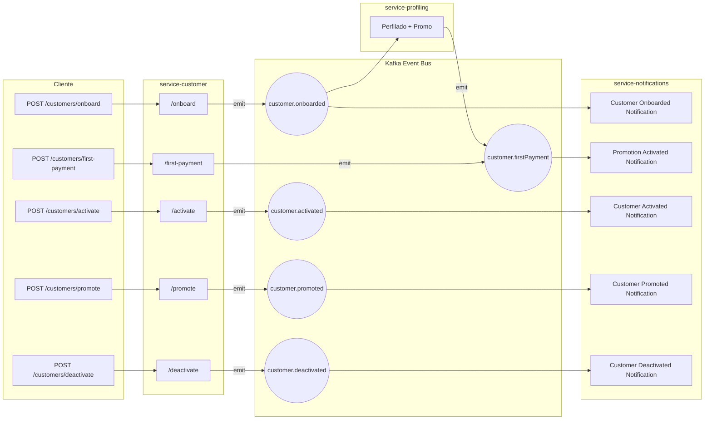

# POC Customers Nest Kafka

POC (Proof of Concept) de una arquitectura de microservicios usando NestJS y Kafka para la gestión de clientes en una fintech.

## 🏗️ Arquitectura

Este proyecto implementa una arquitectura de microservicios con comunicación asíncrona usando Apache Kafka:



## 📦 Servicios

### 1. **Service-Customer** (`apps/service-customer/`)

- **Responsabilidad**: Gestión del ciclo de vida de clientes
- **Puerto**: 3001

### 2. **Service-Profiling** (`apps/service-profiling/`)

- **Responsabilidad**: Análisis y perfilado de clientes
- **Puerto**: 3002

### 3. **Service-Notifications** (`apps/service-notifications/`)

- **Responsabilidad**: Envío de notificaciones (email, SMS)
- **Puerto**: 3003

## 🔧 Módulo Compartido de Kafka

### 📦 **@shared/kafka** (`packages/shared/kafka/`)

Módulo unificado de Kafka que reemplaza las implementaciones duplicadas en cada servicio:

#### 📋 **Configuración por servicio:**

```typescript
// Service-Customer
KafkaModule.forRoot({
  clientId: 'service-customer',
  groupId: 'customers-group',
  topics: {
    emit: ['customer.onboarded', 'customer.activated', 'customer.deactivated', 'customer.promoted'],
    consume: ['notification.sent']
  }
})

// Service-Profiling
KafkaModule.forRoot({
  clientId: 'service-profiling',
  groupId: 'profiling-group',
  topics: {
    emit: ['customer.profiled'],
    consume: ['customer.onboarded', 'customer.activated']
  }
})

// Service-Notifications
KafkaModule.forRoot({
  clientId: 'service-notifications',
  groupId: 'notifications-group',
  topics: {
    consume: ['customer.onboarded', 'customer.activated', 'customer.promoted']
  }
})
```

## 🚀 Instalación y Configuración

### Prerrequisitos

- Node.js 18+
- Docker y Docker Compose
- pnpm (recomendado) o npm

## Opción full docker

### Iniciar servicios

`docker-compose up -d`

### Ver logs

`docker-compose logs -f`

### Verificar estado

`docker-compose ps`

## Opción manual

### 1. Clonar el repositorio

```bash
git clone <repository-url>
cd poc-customers-nest-kafka
```

### 2. Instalar dependencias

```bash
# Instalar dependencias del paquete compartido
cd packages/shared/kafka
pnpm install
pnpm run build

# Volver al directorio raíz
cd ../../

# Instalar dependencias de todos los servicios
cd apps/service-customer && pnpm install && cd ../..
cd apps/service-profiling && pnpm install && cd ../..
cd apps/service-notifications && pnpm install && cd ../..
```

### 3. Levantar Kafka con Docker

```bash
docker-compose -f docker-compose.kafka.yml up -d
```

### 4. Iniciar los servicios

```bash
# Terminal 1 - Service Customer
cd apps/service-customer && pnpm run start:dev

# Terminal 2 - Service Profiling
cd apps/service-profiling && pnpm run start:dev

# Terminal 3 - Service Notifications
cd apps/service-notifications && pnpm run start:dev
```

### 5. Tests

```bash
cd apps/service-customer && pnpm run test && cd ../..
cd apps/service-profiling && pnpm run test && cd ../..
cd apps/service-notifications && pnpm run test && cd ../..
```
